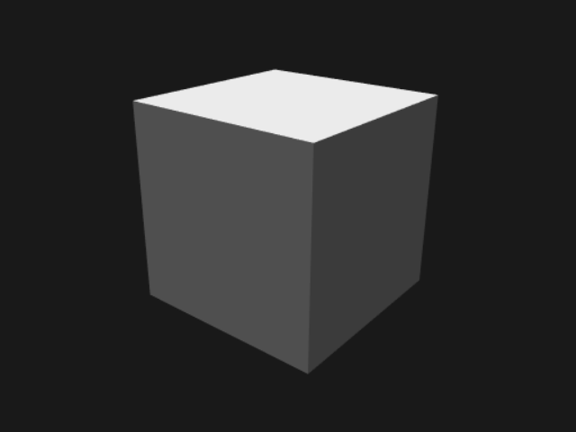

# Using Webpack to Build a PlayCanvas App

There are lots of options for building a PlayCanvas app. One is to use [Webpack](https://webpack.js.org/), a popular JavaScript bundler.

This project doesn't load the PlayCanvas engine via a script tag. Instead, it imports the engine as an [NPM package](https://www.npmjs.com/package/playcanvas) (see the repo's `package.json` file). The `src/index.js` script then imports the PlayCanvas (`pc`) API with the following statement:

```
import * as pc from 'playcanvas';
```

## How to Build

Run:

```
npm install
npm run build
```

This will output the built PlayCanvas app to the `dist` folder.

## How to Run

Run:

```
npm run serve
```

Open `http://localhost:5000/` in your browser of choice. You should see a spinning cube:


